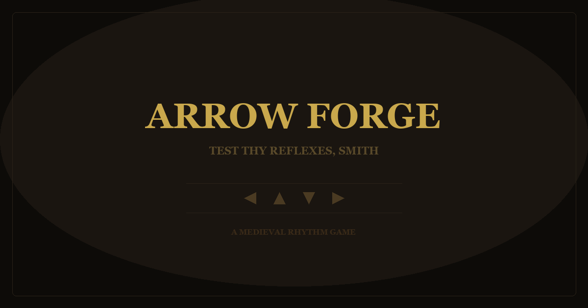

# 🏹 Arrow Forge

A medieval arrow-key rhythm game. Match the falling runes with your arrow keys, build blazing combos, and forge your way up the leaderboard before the forge grows cold.

**Live demo:** https://arrow-forge.vercel.app



## Gameplay

Runes fall down four lanes. Strike the matching arrow key (← ↑ ↓ →) as each one crosses the line.

- **Perfect** hit (within 15px of the line): 150 points
- **Good** hit: 100 points
- Chain hits without missing to build a **combo**: it catches fire at x10 and the multiplier climbs every 5 hits
- You start with **5 lives**; every miss costs one. Lose them all and the forge goes cold.

## Difficulty curve

The forge heats up every 600 points: arrows fall faster (speed 2.5 ramping to 5.5) and spawn more often (every 1100ms tightening to 450ms), and the soundtrack intensifies right along with it.

## Features

- **Procedural medieval soundtrack** built live with the Web Audio API (no audio files), intensifying across 4 levels as you climb
- Reactive sound effects for perfect hits, misses, and level-ups
- **Local high-score leaderboard** saved in your browser (localStorage), with name entry on a new record
- Atmospheric forge styling: floating embers, glowing runes, level-up flashes
- Zero dependencies, zero build step

## Tech

Vanilla HTML, CSS, and JavaScript. Web Audio API for the music and SFX, localStorage for the leaderboard. Deployed on Vercel as a static site.

## Run locally

```bash
git clone https://github.com/1shanpanta/arrow-forge.git
cd arrow-forge
# open index.html directly, or serve it:
python3 -m http.server 8000   # then visit http://localhost:8000
```

## Controls

| Key | Action |
| --- | --- |
| ← ↑ ↓ → | Strike the matching falling rune |
| ♫ button | Toggle the soundtrack |
